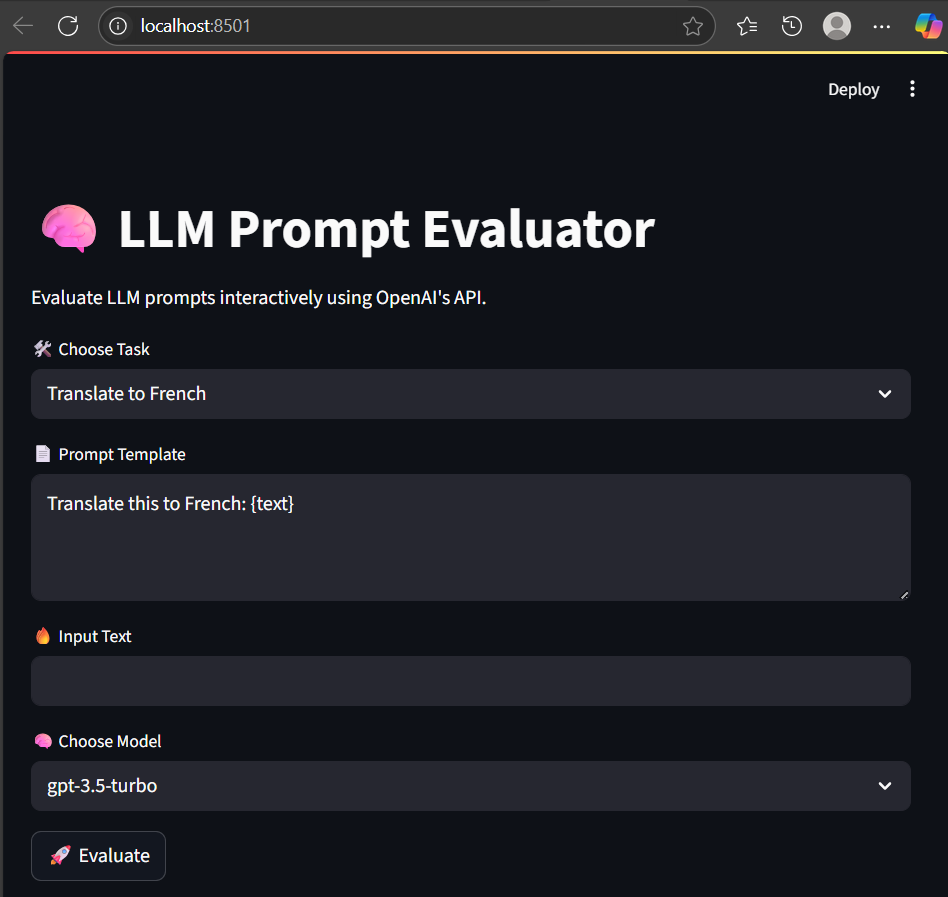

# 🧠 LLM Prompt Evaluator

An interactive web app built with Streamlit that lets you evaluate LLM (Large Language Model) prompts using OpenAI's API. Choose from predefined tasks like translation, summarization, or grammar correction, and instantly see the output.

---

## 🚀 Features

- 🔄 Translate text to French  
- ✍️ Summarize content  
- ✅ Fix grammar in English  
- 🧪 Instantly evaluate prompts via OpenAI's API  
- 🧠 Choose between GPT-3.5-Turbo and GPT-4  

---

## 📸 Screenshot



---

## 🛠️ Technologies Used

- [Python 3.12+](https://www.python.org/)
- [Streamlit](https://streamlit.io/)
- [OpenAI Python SDK (v1.x)](https://github.com/openai/openai-python)
- [python-dotenv](https://pypi.org/project/python-dotenv/)

---

## 🔧 Setup Instructions

1. **Clone this repo**  
   ```bash
   git clone https://github.com/SDas312/llm-promptevaluator.git
   cd llm-promptevaluator

